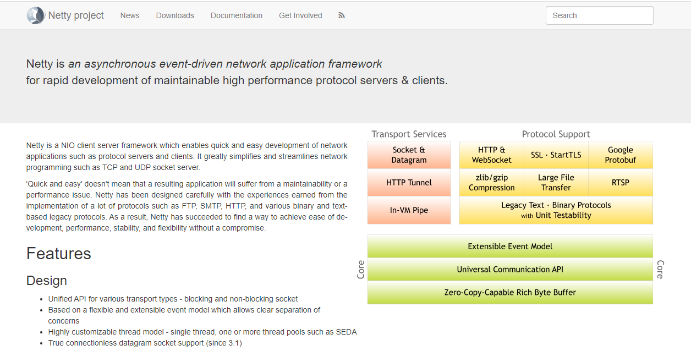

# 一、Netty 简介

> 为什么写这篇文章？

这篇文章是对 Netty 的基础介绍，偏概念和理论。主要从概念上介绍什么是 Netty、应用领域 、特性、社区活跃度、发展趋势等。

内容大多来自网络，搜集后自己整理，对于之前没有接触过 Netty 的同学做一点基础介绍。不会在我提到 Netty 的时候问：“Netty 是大数据计算组件吗？”

## 介绍
Netty 是一个 `Java NIO` 的高性能网络编程应用框架，是目前 Java 领域最主流的网络编程框架。

> 为什么做 web 服务端开发的程序员对网络编程没啥感知？

提到网络编程库，对于做业务开发的同学可能没啥感知，比如我一个 web 服务端开发 —— Java CRUD BOY 完全不知道网络编程要干啥。大部分人都会接触的网络编程是 `Java BIO`，就是 `Socket` 这块儿，还有的同学可能看过 `Java1.4`推出的 `NIO`，`Channel`、`Buffer`、`Selector`这些。

网络编程都在用在哪儿呢？只要涉及网络传输的网络应用都使用了网络编程。但在平常的 web 服务开发时，我们使用了`Tomcat`、`JBoss`、`Jetty`等支持 `servlet`规范的 web 服务器，网络连接的建立、数据的读写、序列化、协议的编解码、都由底层的 web 容器完成，我们只需要专注于业务代码编写。

相比于 web 容器，Netty 是面向**网络传输层协议(Socket)** 的网络编程框架，也可以用来开发 Web 服务器。Netty 不仅支持 HTTP 协议，还支持 SSH、TLS/SSL 等多种应用层的协议，它支持的协议更广泛，还可以自定义通信协议。

## 特性
对于一款网络编程框架，下面是几个我们绕不开的几个关注点：
- I/O 模型
- 线程模型
- 事件处理机制
- 对数据协议、序列化的支持
- API 的易用性

在后续的文章，我将介绍为啥这些我们要关注这些东西。Netty 采用 I/O 多路复用模型、主从 `Reactor` 线程模型，具有高性能、低延时的特征； API 设计简单易用，相比于 Java NIO 繁琐的 API ，极大的降低了开发者的心智负担和编程难度；Netty 设计扩展性好，；并且对 http、websocket等许多协议提供丰富的支持。正是因为在这些方面表现突出，所以 Netty 成为 Java 在网络编程领域的首选。

## 社区活跃度
Netty 社区活跃，迭代周期短且文档比较齐全，遇到任何问题通过 issue 或者邮件都可以得到非常及时的答复。目前，Netty 官方提供 3.x、4.x 的稳定版本，之前一直处于测试阶段的 5.x 版本已被作者放弃维护，当下主流的版本是 Netty 4.x。

链接：[社区地址](https://netty.io/)

## 发展趋势
Netty 是目前最流行的一款高性能 Java 网络编程框架，它被广泛使用在中间件、直播、社交、游戏等领域。使用 Netty 的大厂也不在少数：

截止至 2020 年 7 月，Netty 在 github 上获取2.4w+ star，一共被 4w+ 的项目所使用。目前，许多知名的开源软件也都将 Netty 用作网络通信的底层框架，Netty 经过很多出名产品在线上的大规模验证，其健壮性和稳定性都被业界认可，其中典型的产品有：
- 服务治理：Apache Dubbo、gRPC。
- 大数据：Hbase、Spark、Flink、Storm。
- 搜索引擎：Elasticsearch。
- 消息队列：RocketMQ、ActiveMQ。
  [更多查看官方 wiki](https://netty.io/wiki/related-projects.html)

## 后记
这是我写公众号以来，第一次写技术文章，虽然文章写的没啥技术含量。我的公众号从一开始的定位就是技术类的个人 IP 账号，但是因为水平有限一直没有写过技术文章。上班入职后，公司新人要做技术分享，借此契机开始写技术文章。虽然也没人看，但错误和不足之处，希望读者朋友在后台私信指出，如果觉得不错就点个在看吧^-^