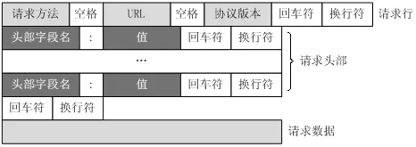
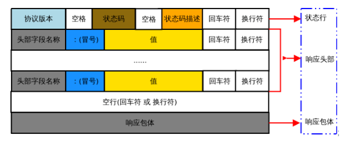
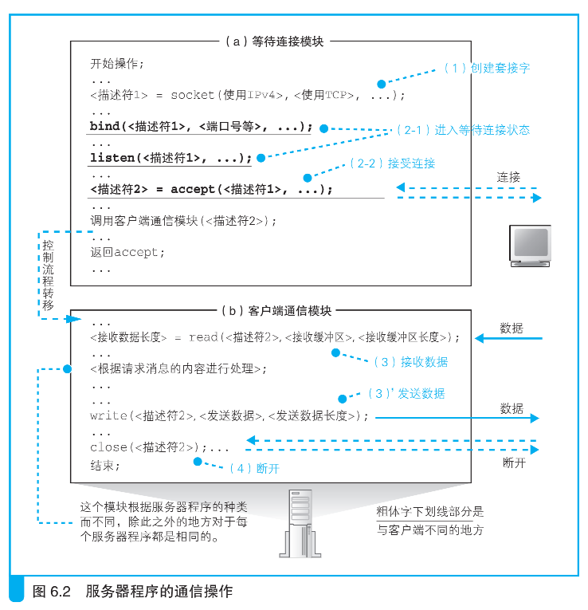
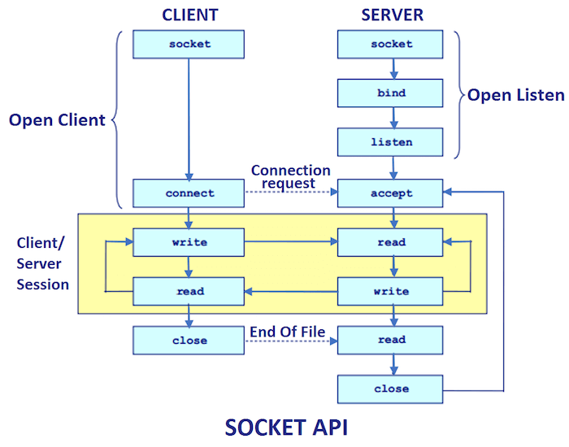
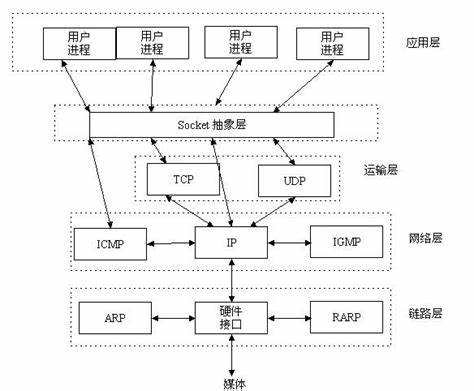
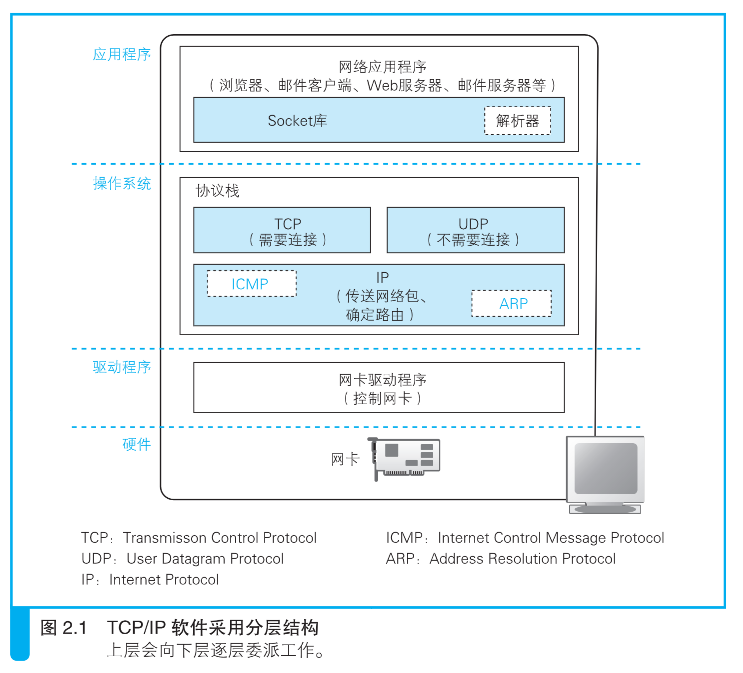

# 二、网络编程都干啥？

> 这是 Netty 系列文章的第二篇， Netty 是一款网络编程框架，在介绍 Netty 技术之前，先来聊聊网络编程都干啥?

## 后端开发不用网络编程？

我们平常的开发的 `Java Web` 程序，都运行在 Tomcat 等 web 容器当中。所以虽然 web 应用是网络应用，但网络编程对我们来说是透明的，不被感知的。

在 servlet 中有全局域对象：request、response，用于获取 Http 请求和响应的信息；spring 中提供了 HttpServletRequest、HttpServletResponse，借助 web 容器和框架，因此我们无需直接编写网络编程和协议处理的代码，通过使用框架提供的封装好的类库，也能很方便的开发自己的业务。

## 网络编程怎么做？

> 如果没有 web 容器，要怎样实现一个简单的 http GET 请求和并返回响应呢？

**talk is cheap, show your code.** 上代码：


```java
/**
 * Http 服务端
 */
@Slf4j
public class SocketHttpServer {

    public static void main(String[] args) {
        new SocketHttpServer().start();
    }


    /**
     * 启动服务器
     */
    public void start() {
        int port = 8080;
        try {
            // 0.绑定端口
            ServerSocket serverSocket = new ServerSocket(port);
            log.info("服务端开始启动，端口 port: {}", port);
            Socket socket;
            // 1.循环监听 and 2.建立连接
            while (Objects.nonNull((socket = serverSocket.accept()))) {
                log.info("建立连接，客户端 IP:[{}], 端口 port:[{}]", socket.getInetAddress().getHostAddress(), socket.getPort());
                try (BufferedInputStream inputStream = new BufferedInputStream(socket.getInputStream());
                     BufferedOutputStream outputStream = new BufferedOutputStream(socket.getOutputStream())) {

                    // 3.input : 读取数据
                    byte[] buffer = new byte[1024 * 256];
                    int length = inputStream.read(buffer);

                    // 4.compute : 计算
                    // 4.1 编码
                    HttpDecoder httpDecoder = new HttpDecoder();
                    Map<String, String> request = httpDecoder.encode(buffer, length);
                    if (Objects.isNull(request)) {
                        log.info("-------------- 断开连接 --------------\n");
                        continue;
                    }
                    // 4.2 业务处理
                    log.info("url: {}", request.get("Url"));
                    log.info("method: {}", request.get("Method"));
                    log.info("data: {}", request.get("Data"));
                    String responseContent = "这是我的 http web 服务器 ^-^";
                    // 4.3 编码
                    HttpEncoder httpEncoder = new HttpEncoder();
                    byte[] response = httpEncoder.encode(responseContent);

                    // 5.output : 返回数据
                    outputStream.write(response);
                    outputStream.flush();

                    // 6.断开连接
                    log.info("-------------- 断开连接 --------------\n");
                    socket.close();
                } catch (IOException e) {
                    log.error("发生异常：", e);
                }
            }
        } catch (IOException e) {
            log.error("socket simple 服务端启动异常，{}", e.getMessage());
            e.printStackTrace();
        }

    }
}

```

这里使用大部分人最熟悉的 Java BIO , 这段代码能够体现网络编程服务端的过程：

1. 创建 socket 绑定IP（服务端 IP 是 localhost）、端口；

~~~java
ServerSocket serverSocket = new ServerSocket(port)
~~~

2. 循环监听；
~~~java
while (socket = serverSocket.accept()) != NULL){...}
~~~

3. 有客户端连接上来创建连接 socket 建立连接（连接事件）；
~~~java
socket = serverSocket.accept()
~~~

4. 读取数据，然后执业务处理：
~~~java
byte[] buffer = new byte[1024 * 256];
int length = inputStream.read(buffer);
~~~

这里自定义了一个 http 协议解码类  HttpDecoder，从网络传输的数据是经过序列化的 “0101”这样的二进制字节流，所以要先反序列化：**将字节数组转成 Java 中的对象 String**，然后按 Http 协议的格式进行解析，将请求信息（请求行、method、uri、请求头、请求体数据)获取到一个 Map 中。

~~~java
Map<String, String> request = httpDecoder.deEncode(buffer, length);
~~~

下面是 HTTP 协议请求数据格式：




- `HttpDecoder` 代码

~~~java
@Slf4j
public class HttpDecoder {

    /**
     * 解码
     *
     * @param buffer 字节数组
     * @param length 数据长度
     * @return 转换后的 Java Map 对象
     */
    public Map<String, String> decode(byte[] buffer, int length) {

        StringBuffer httpContent = new StringBuffer();
        httpContent.append(new String(buffer, 0, length));

        log.debug("服务端接收请求：\n{}", httpContent);
        if (httpContent.length() <= 0) {
            log.info("数据不符合 http 格式，处理结束！");
            return null;
        }

      
        String[] content = httpContent.toString().split(EMPTY_LINE);
        String[] lines = content[0].split(LINE_BREAK);
        Map<String, String> request = new HashMap<>();
        // 请求行
        String header = lines[0];
        request.put("Header", header);
        String[] headerInfo = header.split(SPACE);

        request.put("Method", headerInfo[0]);
        request.put("Uri", headerInfo[1]);
        request.put("Protocol", headerInfo[2]);

        // 请求头
        for (int i = 1; i < lines.length; i++) {
            String[] line = lines[i].split(LINER_SPLIT);
            request.put(line[0], line[1]);
        }
        String url = request.get("Host") + request.get("Uri");
        request.put("Url", url);

        // 数据
        if (content.length > 1) {
            request.put("Data", content[1]);
        }
        return request;
    }
}

~~~

抽取的公共常量（协议内容分割符）：
~~~java
    public static final String LINE_BREAK = "\r\n";
    public static final String LINER_SPLIT = ": ";
    public static final String EMPTY_LINE = "\r\n\r\n";
    public static final String SPACE = "\\s";
~~~

- 然后进行业务处理

> 打印请求的 url, method 和 请求体数据
- 准备给浏览器的响应数据
~~~java
HttpEncoder httpEncoder = new HttpEncoder();
byte[] response = httpEncoder.encode(responseContent);
~~~

这里自定义了一个的 http 协议编码类 HttpEecoder，encode 方法将响应给浏览器的数据 Java 字符串，按 Http 协议的格式进行组装，添加上状态行、消息包头部。

- http 响应格式




- Java 对象序列化

组装完返回给客户端的 response 对象，要通过网络传输，所以得序列化成字节流。
~~~java
response.toString().getBytes(StandardCharsets.UTF_8)
~~~

- 协议编码类：`HttpEncoder`

~~~java
@Slf4j
public class HttpEncoder {

    Map<String, String> response = new HashMap<>();

    public byte[] encode(String content) {
        StringBuffer response = new StringBuffer();
        // 状态行
        String statusLine = "HTTP/1.1 200 OK";
        response.append(statusLine).append(LINE_BREAK);

        // 消息包头
        response.append("Server").append(LINER_SPLIT).append("CaijuanCat").append(LINE_BREAK);
        response.append("Content-Type").append(LINER_SPLIT).append("text/plain;charset=UTF-8").append(LINE_BREAK);

        // 返回数据
        response.append(EMPTY_LINE);
        response.append(content);

        log.debug("服务端发送响应：\n{}", response);
        return response.toString().getBytes(StandardCharsets.UTF_8);
    }
}
~~~

5. 写数据

~~~java
outputStream.write(response);
outputStream.flush();
~~~

6. 关闭连接

~~~java
socket.close();
~~~

上面是用代码描述网络编程服务端的流程，如果用图示描述如下：


### 客户端和服务端完整流程

下图是服务端和客户端使用 socket 通信的完整过程：



客户端和服务端类似，区别在于：

- 服务端创建 socket 只需要指定端口，IP 就是本机，服务端 I/O 是等待连接 accept 事件；客户端 socket 要指定待连接的服务器 IP 和端口，客户端的端口是随机的，客户端 I/O 是发起连接 connect 事件；
- 服务端要处理若干个客户端的请求，服务端和客户端是 1:n 的关系,所在在指定端口循环监听；客户端不需要循环监听，发起请求到会话结束就关闭连接。实际场景中也是客户端有需要的时候上线，服务端 7 x 24 小时在线提供服务。


## 什么是 socket?

> 那 socket 是个啥？

某SDN: https://blog.csdn.net/github_34606293/article/details/78230456

> 实际上socket是对TCP/IP协议的封装，它的出现只是使得程序员更方便地使用TCP/IP协议栈而已。socket本身并不是协议，它是应用层与TCP/IP协议族通信的中间软件抽象层，是一组调用接口（TCP/IP网络的API函数）



《网络是怎样链接的》:

> Socket 库是用于调用网络功能的程序组件集合。



某乎：https://www.zhihu.com/tardis/sogou/art/339230587

> 每一个 socket 都用一个半相关描述{协议、本地地址、本地端口}来表示；一个完整的套接字则用一 个相关描述{协议、本地地址、本地端口、远程地址、远程端口}来表示。socket 也有一个类似于打开文 件的函数调用，该函数返回一个整型的 socket 描述符，随后的连接建立、数据传输等操作都是通过 socket 来实现的；

## 总结

- **网络编程**

网络编程最主要的工作就是：在发送端把信息通过规定好的协议进行组装包，在接收端按照规定好的协议把包进行解析，从而提取出对应的信息，达到通信的目的。**网络编程的实质是跨主机跨网络的线程间通信**。


- **socket 组件**

socket是应用层与TCP/IP协议族通信的中间软件抽象层，是为了程序员开发的一组编程接口。

> socket 在收发数据的操作分为若干个阶段，客户端可以大致总结为以下 4 个：

（1）创建套接字（创建套接字阶段）

（2）将管道连接到服务器端的套接字上（连接阶段）

（3）收发数据（通信阶段）

（4）断开管道并删除套接字（断开阶段）

> 服务器是将阶段（2）改成了等待连接，具体如下：

（1）创建套接字（创建套接字阶段）

（2-1）将套接字设置为等待连接状态（等待连接阶段）

（2-2）接受连接（接受连接阶段）

（3）收发数据（收发阶段）

（4）断开管道并删除套接字（断开阶段）

- **为什么要讲这个？**

**问题是解决方案出发的原点**，技术是解决问题的工具，要明白技术为什么要那么设计和实现，就必须先明确它要解决的问题。


## 参考

[Socket到底是什么？](https://blog.csdn.net/github_34606293/article/details/78230456)

[HTTP协议格式详解](https://www.jianshu.com/p/8fe93a14754c)

《网络是怎样连接的》